# Academix.io Technical Architecture

## System Architecture Diagram

```mermaid
graph TB
    subgraph "Frontend - Vercel"
        UI[Next.js 16 UI]
        UI --> Dashboard[Dashboard]
        UI --> ReportStudio[Report Studio]
        UI --> Transcribe[Transcription Hub]
        UI --> Settings[Settings Page]
        UI --> History[History]
        
        Settings --> LocalStorage[Browser LocalStorage<br/>API Keys Storage]
    end
    
    subgraph "Backend - Railway"
        API[FastAPI Server<br/>Port 8080]
        
        subgraph "Core Engine"
            CrewAI[CrewAI Orchestrator]
            
            subgraph "AI Agents"
                Planner[Planner Agent<br/>Workflow Router]
                YouTube[YouTube Media Assistant]
                Coder[Coder Agent<br/>Code Execution]
                LabReport[Lab Report Generator]
                Numerical[Numerical Methods Agent]
                Writer[Elite Academic Writer<br/>Document Architect]
            end
        end
        
        subgraph "Tools & Services"
            YTDownloader[YouTube Downloader<br/>+ Bot Bypass]
            Whisper[Faster Whisper<br/>Transcription]
            CodeCompiler[Code Compiler Tool]
            DataViz[Data Visualization Tool]
            WebSearch[Web Search Tool<br/>Serper API]
            Citation[Citation Finder Tool]
            Grammar[Grammar Checker]
            Plagiarism[Plagiarism Checker]
            Wolfram[Wolfram Alpha Tool]
            Octave[Octave Online Tool]
            PDFParser[Smart PDF Parser<br/>Adobe API]
            NotionTool[Notion Integration]
        end
        
        subgraph "Bot Bypass System"
            BotBypass[Bot Bypass Manager]
            UserAgent[User Agent Rotator<br/>6 Browser Agents]
            RetryHandler[Retry Handler<br/>Exponential Backoff]
            CookieManager[Cookie Manager<br/>Optional Auth]
            ErrorClassifier[Error Classifier<br/>Smart Error Handling]
        end
        
        Memory[(SQLite Database<br/>Chat History<br/>Study Notes)]
    end
    
    subgraph "External APIs"
        OpenAI[OpenAI API<br/>GPT-4o-mini]
        Groq[Groq API<br/>Llama 3 70B]
        Serper[Serper API<br/>Web Search]
        NotionAPI[Notion API]
        AdobeAPI[Adobe PDF Services]
        WolframAPI[Wolfram Alpha API]
        OctaveAPI[Octave Online API]
        YouTubeAPI[YouTube<br/>yt-dlp]
    end
    
    subgraph "Processing Pipeline"
        FFMPEG[FFmpeg<br/>Audio Chunking<br/>16kHz Mono]
        WhisperWorkers[Parallel Whisper Workers<br/>4 Threads]
    end
    
    %% Frontend to Backend
    UI -->|HTTPS + API Keys<br/>in Headers| API
    
    %% API Routes
    API --> |/api/chat| CrewAI
    API --> |/api/report| CrewAI
    API --> |/api/transcribe| YTDownloader
    API --> |/api/history| Memory
    API --> |/api/report/export| ReportExporter[Report Exporter<br/>Markdown to DOCX]
    
    %% CrewAI Orchestration
    CrewAI --> Planner
    Planner --> YouTube
    Planner --> Coder
    Planner --> LabReport
    Planner --> Numerical
    Planner --> Writer
    
    %% Agent Tool Usage
    YouTube --> YTDownloader
    YouTube --> Whisper
    Coder --> CodeCompiler
    Coder --> DataViz
    LabReport --> PDFParser
    LabReport --> WebSearch
    LabReport --> Octave
    Numerical --> Octave
    Writer --> Citation
    Writer --> Grammar
    Writer --> WebSearch
    
    %% YouTube Bot Bypass Flow
    YTDownloader --> BotBypass
    BotBypass --> UserAgent
    BotBypass --> RetryHandler
    BotBypass --> CookieManager
    BotBypass --> ErrorClassifier
    BotBypass --> YouTubeAPI
    
    %% Transcription Pipeline
    YTDownloader --> FFMPEG
    FFMPEG --> WhisperWorkers
    WhisperWorkers --> Whisper
    
    %% External API Connections
    CrewAI -.->|LLM Requests| OpenAI
    CrewAI -.->|LLM Requests| Groq
    WebSearch -.-> Serper
    NotionTool -.-> NotionAPI
    PDFParser -.-> AdobeAPI
    Wolfram -.-> WolframAPI
    Octave -.-> OctaveAPI
    
    %% Memory Storage
    CrewAI --> Memory
    API --> Memory
    
    %% Styling
    classDef frontend fill:#8b5cf6,stroke:#7c3aed,color:#fff
    classDef backend fill:#3b82f6,stroke:#2563eb,color:#fff
    classDef agents fill:#10b981,stroke:#059669,color:#fff
    classDef tools fill:#f59e0b,stroke:#d97706,color:#fff
    classDef external fill:#ef4444,stroke:#dc2626,color:#fff
    classDef bypass fill:#ec4899,stroke:#db2777,color:#fff
    
    class UI,Dashboard,ReportStudio,Transcribe,Settings,History,LocalStorage frontend
    class API,CrewAI,Memory,ReportExporter backend
    class Planner,YouTube,Coder,LabReport,Numerical,Writer agents
    class YTDownloader,Whisper,CodeCompiler,DataViz,WebSearch,Citation,Grammar,Plagiarism,Wolfram,Octave,PDFParser,NotionTool,FFMPEG,WhisperWorkers tools
    class OpenAI,Groq,Serper,NotionAPI,AdobeAPI,WolframAPI,OctaveAPI,YouTubeAPI external
    class BotBypass,UserAgent,RetryHandler,CookieManager,ErrorClassifier bypass
```

## Component Details

### Frontend (Vercel)
- **Framework**: Next.js 16.2.3
- **Styling**: Tailwind CSS + Framer Motion
- **State Management**: Zustand
- **Deployment**: Vercel (automatic deployments)
- **Features**:
  - Dashboard with particle background
  - Report Studio for lab report generation
  - Transcription Hub for YouTube/audio transcription
  - Settings page for API key management
  - History tracking

### Backend (Railway)
- **Framework**: FastAPI
- **AI Orchestration**: CrewAI
- **Transcription**: Faster Whisper (base model, CPU, int8)
- **Audio Processing**: FFmpeg
- **Database**: SQLite (chat history, notes)
- **Deployment**: Railway (Docker container)

### Bot Bypass System (NEW)
- **User Agent Rotation**: 6 realistic browser agents
- **Retry Logic**: Exponential backoff (2s → 32s, max 4 retries)
- **Cookie Support**: Optional Netscape format cookies
- **Error Classification**: Smart error handling with user-friendly messages
- **Logging**: Structured logging for monitoring

### AI Agents
1. **Planner Agent**: Routes workflows and creates execution plans
2. **YouTube Media Assistant**: Handles video transcription
3. **Coder Agent**: Executes code and generates output
4. **Lab Report Generator**: Creates academic lab reports
5. **Numerical Methods Agent**: Solves numerical problems
6. **Elite Academic Writer**: Produces doctoral-level reports

### External APIs
- **OpenAI**: GPT-4o-mini for LLM tasks
- **Groq**: Llama 3 70B (alternative LLM)
- **Serper**: Web search (2,500 free searches/month)
- **Notion**: Note storage integration
- **Adobe PDF Services**: Advanced PDF parsing
- **Wolfram Alpha**: Mathematical computations
- **Octave Online**: MATLAB/Octave code execution
- **YouTube**: Video download via yt-dlp

### Data Flow
1. User submits request via frontend
2. API keys sent in HTTP headers (not stored on server)
3. FastAPI routes to appropriate endpoint
4. CrewAI orchestrates multi-agent workflow
5. Agents use specialized tools
6. Results stored in SQLite and returned to frontend
7. Frontend displays formatted results

### Security
- API keys stored in browser localStorage only
- Keys sent per-request via HTTP headers
- No server-side key storage
- CORS enabled for frontend-backend communication
- Environment variables for sensitive configuration

### Scalability
- Stateless backend (horizontal scaling ready)
- Parallel transcription workers (4 threads)
- Streaming audio processing (no intermediate files)
- Railway auto-scaling support
